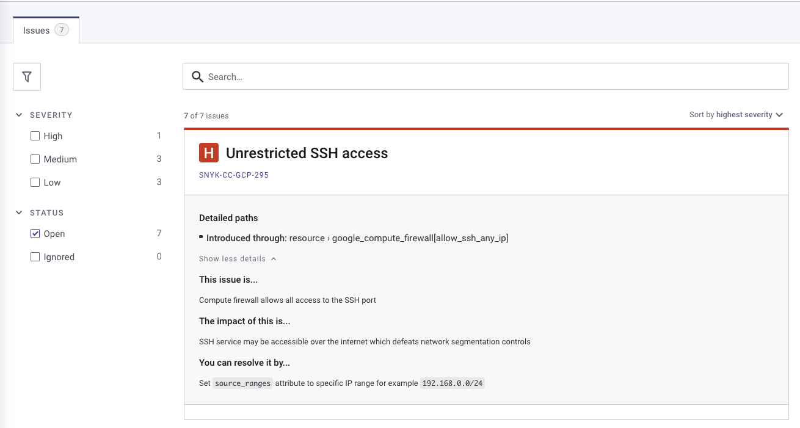

# TF config for use alongside Snyk RunTask tutorial

Tutorial : [Configure Snyk Run Task in Terraform Cloud
](https://developer.hashicorp.com/terraform/tutorials/cloud/cloud-run-tasks-snyk#change-run-task-enforcement-level)

The TF config in this repo will trigger some security warnings from Snyk if you set up their RunTask in a workspace and use this config to make a Run.

I'd recommend using `Execution mode: Remote` in TFC and using this config with the `terraform` CLI.

Remember to:
- Edit the `terraform` block to point at your TFC org and workspace
- Use `terraform login` to make sure your CLI has auth to interact with TFC (if using remote execution)
- Either set up your variables in `terraform.tfvars` or in your TFC workspace

## Screenshots

Here's a look at the number of warnings Snyk returns after planning a run from this config

### In TFC

### In Snyk (linked to from TFC)

